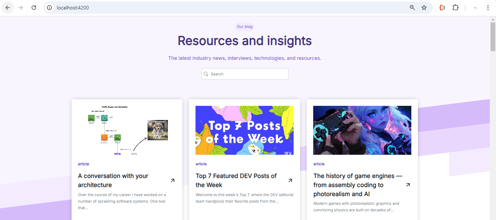
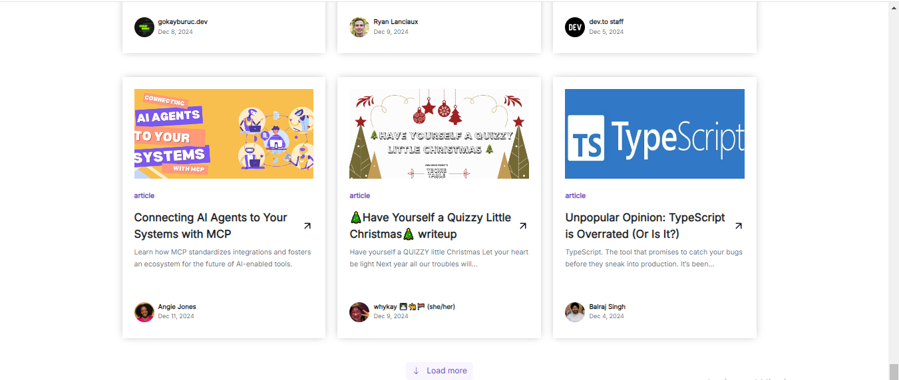

Educatly Angular Task:
An Angular application to view and manage articles. Users can browse through articles, view details

Overview:

Features
Technologies Used
Setup Instructions
Running the Project
Folder Structure
Testing
Deployment

Overview:
This project is a web application built with Angular, allowing users to view articles in a list format.. The app is designed to provide a simple, user-friendly interface for reading articles and exploring content.

Key features of the app include:
A dynamic article list.
A responsive layout for mobile and desktop views.
Integration with a backend API to fetch and display articles.

Features:
Article List: View a list of articles with titles, summaries, and links to full details.
Responsive Design: The application is fully responsive and optimized for both mobile and desktop devices.
Article Details Page: Clicking on an article will take the user to a detailed view with the full content.
Pagination: Handle large datasets by paginating articles.
API Integration: Articles are fetched from a backend API (can be simulated using JSON Server or any mock API).

Technologies Used:
This project leverages the following technologies:

Angular: Frontend framework for building the single-page application.
TypeScript: Strongly typed superset of JavaScript.
RxJS: For managing asynchronous operations and event-based programming.
Angular Material: A UI component library for creating a modern and responsive design.
Bootstrap: For additional responsive grid layout (if used).
Backend API:  backend server to call article data.
Angular Router: For navigating between different pages of the app.
SCSS: For writing modular, reusable styles.

Setup Instructions:
Follow these steps to set up the project locally:

Clone the repository:

git clone https://github.com/kem73/educatly-angular-task.git
cd educatly-angular-task

Install dependencies: Ensure you have Node.js and npm installed. Then, run the following command to install the necessary dependencies:
npm install

Start the development server: To run the app locally, use:
ng serve
Navigate to http://localhost:4200 in your browser to view the app.

Running the Project:
To start the application in development mode, use the following command:
ng serve
This will start a local development server at http://localhost:4200/.

For a production build, you can run:
ng build --prod
This will generate a production-ready build in the dist/ folder.

Folder Structure:
Here's a breakdown of the folder structure in this project:

src/
├── app/
│   ├── core/                  # Core services, models, and utilities
│   ├── pages/              # Feature-specific modules like articles
│   │   ├── blog/      # Component for displaying article list
│   ├── app.module.ts          # Main Angular module
│   ├── app.component.ts       # Main component
│   ├── app-routing.module.ts  # Routing configuration
├── assets/                    # Static assets (images, icons, etc.)
├── environments/              # Environment-specific configurations (e.g., development, production)
├── styles/                    # Global styles
└── index.html                 # Main HTML file

Explanation of Key Folders:
core/: Contains singleton services and models, such as the article.service.ts for API calls and shared logic.
pages/: Contains the main features of the application, such as displaying articles and article details.
shared/: Holds reusable UI components (e.g.,badge, error, empty) and custom pipes or directives.
assets/: Stores any images, icons, or other static files used in the application.

Testing:

To run unit tests for the Angular project, you can use the following command:
ng e2e

Deployment:

On Vercel: https://educatly-angular-task.vercel.app/

Images Demo:

Live Demo:

https://educatly-angular-task.vercel.app/